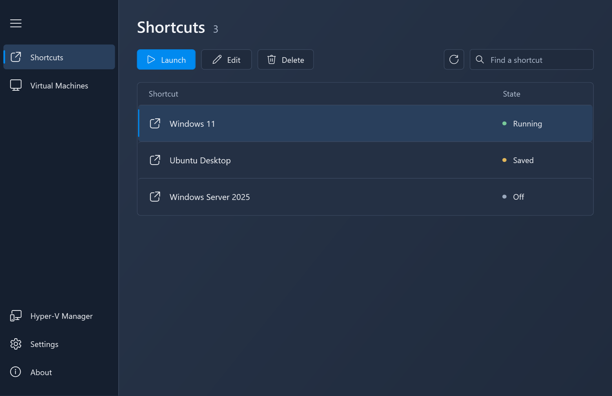
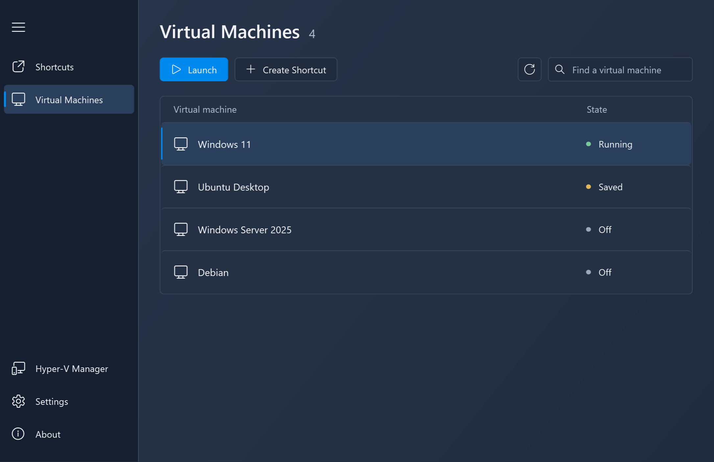
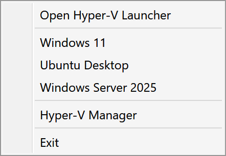
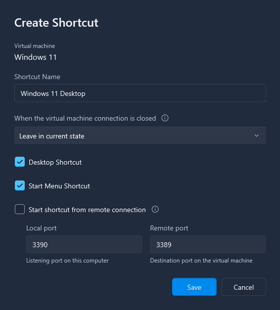

# Hyper-V Launcher

**Your virtual machines. Ready when you are.**

Hyper-V Launcher makes your local Hyper-V virtual machines easier to access. Create desktop and Start Menu shortcuts, launch a VM from the system tray, and choose what happens when its connection window closes.

[Download](https://github.com/andrezammit/hypervlauncher-site/releases/latest/download/HyperVLauncher.Setup.exe) · [Visit the website](https://hypervlauncher.andrezammit.com/) · [Read the guide](https://hypervlauncher.andrezammit.com/guide.html)

Windows x64 · Hyper-V required

## Shortcuts where you need them

Give each VM a recognizable shortcut on your desktop, in the Start Menu, or both. Launch it directly, or use the launcher's Shortcuts page to open and manage your configured machines.

## Launch from the system tray

Your configured VM shortcuts are available from the Hyper-V Launcher tray menu. Open a machine without first opening the management window, and enable **Start on Windows login** to keep the tray application available after you sign in.

## Choose what happens next

Each shortcut can leave the VM in its current state, save its state using **Pause the Virtual Machine**, or request a shutdown when its connection window closes.

Choose the action when creating a shortcut or edit an existing shortcut later. See the [guide to close actions](https://hypervlauncher.andrezammit.com/guide.html#close-actions) for behavior and shutdown considerations.

## Keep your shortcuts in sync

Enable automatic shortcut creation for newly detected VMs, or choose to be prompted first. You can also enable cleanup to remove associated shortcuts when a VM is deleted.

## Get started

1. Make sure Hyper-V is enabled and your VM is available locally in Hyper-V Manager.
2. [Download the setup](https://github.com/andrezammit/hypervlauncher-site/releases/latest/download/HyperVLauncher.Setup.exe) and install Hyper-V Launcher.
3. Open **Hyper-V Launcher Console** from the Start Menu.
4. Select a VM on the **Virtual Machines** page and choose **Create Shortcut**.

The [illustrated guide](https://hypervlauncher.andrezammit.com/guide.html) covers requirements, shortcut creation, automatic actions, and troubleshooting.

[MSI installer](https://github.com/andrezammit/hypervlauncher-site/releases/latest/download/HyperVLauncher.Setup.Installer.msi) · [All releases and release notes](https://github.com/andrezammit/hypervlauncher-site/releases)

Created by [Andre Zammit](https://andrezammit.com).
